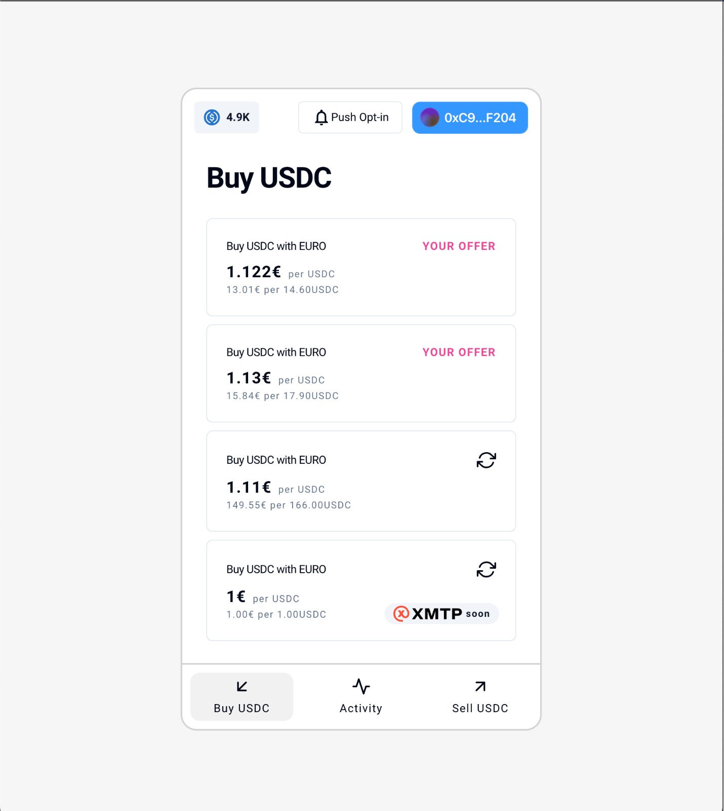

# Le P2P Protocol

## Intro

Introducing LeP2P: A Sybil-Resistant Peer-to-Peer Decentralized Fiat On/Off-Ramp for Crypto application that offers a secure and user-friendly platform for trading fiat for cryptocurrencies.

It employs Worldcoin for Sybil-resistance: enhancing security and trustworthiness.

The platform utilizes smart-contract escrows for seamless, intermediary-free transactions.

LeP2P sets initial transaction limits for Worldcoin ID holders at 1,000 euros and requires KYC verification for higher amounts.

The interface is designed to be user-centric and accessible to users of all levels of expertise.

We also store the payment through Web3 Storage, tapping Filecoin and IPFS

## Technologies Used

- WorldCoin for the user authentication so that we can ensure that the app can only be used by real humans.
- Web3Modal for Wallet Connections
- Quicknode as our Node RPC Provider
- Polygon ID for leveraging verifiable credentials, which for our use case, is a KYC that unlocks for bigger volume in our protocol
- AirStack for querying XMTP enabled wallets
- Push Protocol for Push Notifications in the app for offer creation, completion, cancellation
- Web3Storage: IPFS + Filecoin for decentralized hosting of payment proofs
- The Graph: Indexer for our contract events that serve the protocol current orders and updates them accordingly
- Polygon Mumbai for our contract deployments
- Foundry for smart contract development + deployments + testing
- Next.js with Wagmi + viem for contract interactions in the front-end (shadcn + tailwind <3)

## Repo Structure

- `web`: Our Next.js App
- `contracts`: Our Solidity Contracts + Graph Subgraphs

## Our Contract

[LeP2PEscrow in Polygon Mumbai](https://mumbai.polygonscan.com/address/0xd9a2603ad0be058a5e95172ba542d68e5ee1eb5e)

## Collaborators

Born in ETH Global Paris 2023 🥐 Hackers: @fonstack @ReynaldoQuintero @rplusq
